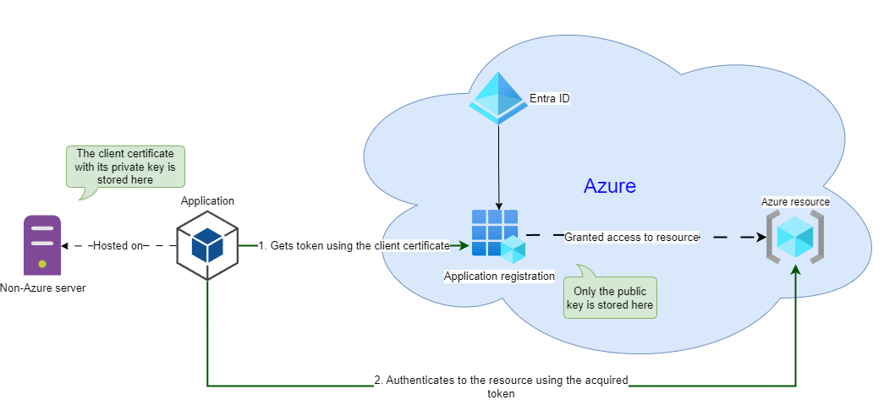

# Certificate-based authentication to Azure services

This solution contains three sample projects to illustrate authentication to Azure using certificates:

* **LowLevelCertApp** - a .NET Console project showing how to read a certificate from a certificate store and use it to authenticate to an Azure Key Vault to read a secret
* **EnvVarCertApp** - a .NET Console project showing how to use the DefaultAzureCredential class and environment variables to read a certificate from a local file and retrieve a Key Vault secret
* **AppSetCertWorker** - a .NET Worker Service project using the configuration from the 'appsettings.json' file to configure credentials for accessing an Azure Key Vault

A high-level configuration diagram of using certificate-based authentication with Azure services:

For an explanation of how it should be configured to work, please check the information in the following blog posts:
