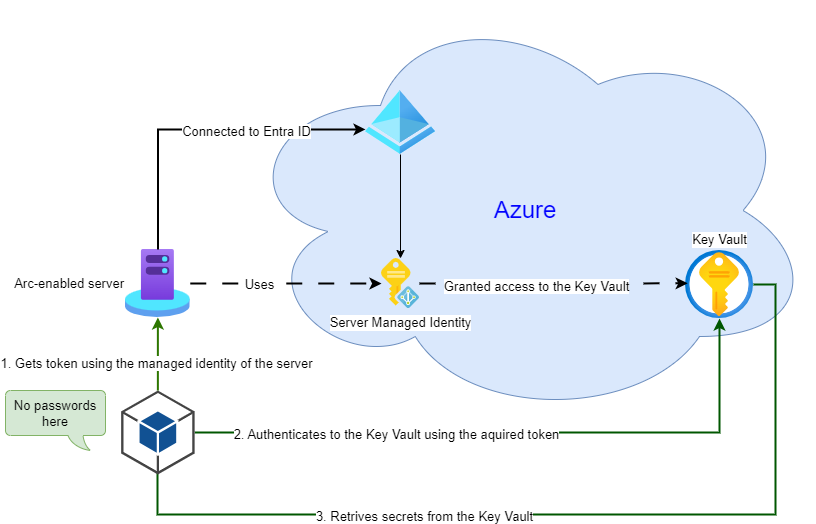

# Authentication with managed identities from non-Azure servers

A high-level configuration diagram of using managed identities to authenticate to Azure services:

For an explanation of how it should be configured to work, please check the information in the following blog posts:

This folder intentionally doesn't contain separate projects to demonstrate the use of managed identities, as the change in the authentication method should not require any changes in the application source code.

The code from the following sample project in the [certificate-based-auth](./certificate-based-auth/) folder will work the same when switching to using managed identities for authentication to Azure services:

* **EnvVarCertApp** - a .NET Console project showing how to use the DefaultAzureCredential class. The DefaultAzureCredential class will try to authenticate with a managed identity when no environment variables are provided.
* **AppSetCertWorker** - a .NET Worker Service project using a configuration file. An alternative authentication configuration in the '[appsettings.json](appsettings.json)' file will force the app to authenticate with a managed identity.
